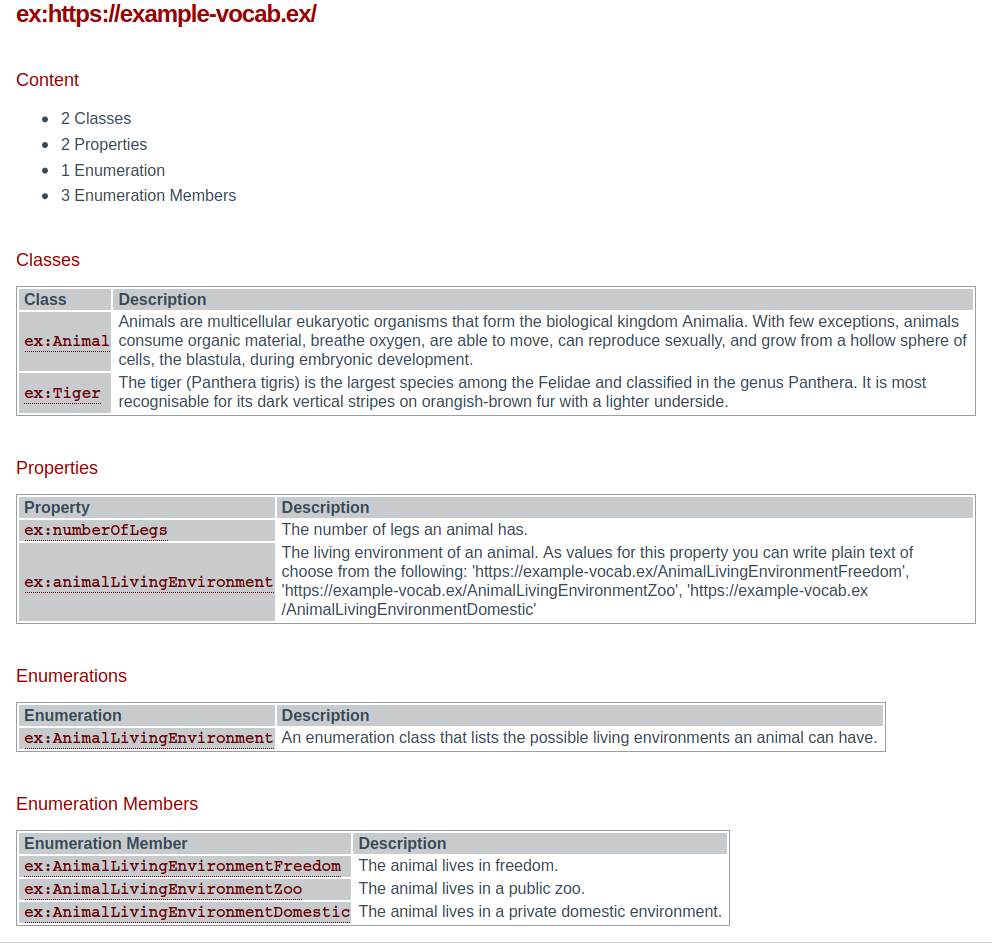

# Schema.org Vocabulary Browser

Vocabulary Browser for schema.org based vocabularies.

## Usage

Require the bundled file in your website:

``` xml
<script src="https://cdn.jsdelivr.net/gh/semantifyit/schema-org-vocab-browser@main/dist/schema-org-vocab-browser.min.js">
```

Import your vocabulary and render the corresponding HTML:

``` xml
<div id="vocab"></div>
<script>
    (async function() {
        const vocabURL = 'https://raw.githubusercontent.com/semantifyit/schema-org-adapter/master/tests/data/exampleExternalVocabulary.json';
        const sdoVocabBrowser = new SDOVocabBrowser(document.getElementById('vocab'), vocabURL);
        await sdoVocabBrowser.render();
    })();
</script>
```

If you want to use the same style as [schema.org](https://schema.org/) just import their CSS file:

``` xml
<link rel="stylesheet" type="text/css" href="https://schema.org/docs/schemaorg.css">
```

TODO: Add npm installation possibility, add CDN

## Screenshot


